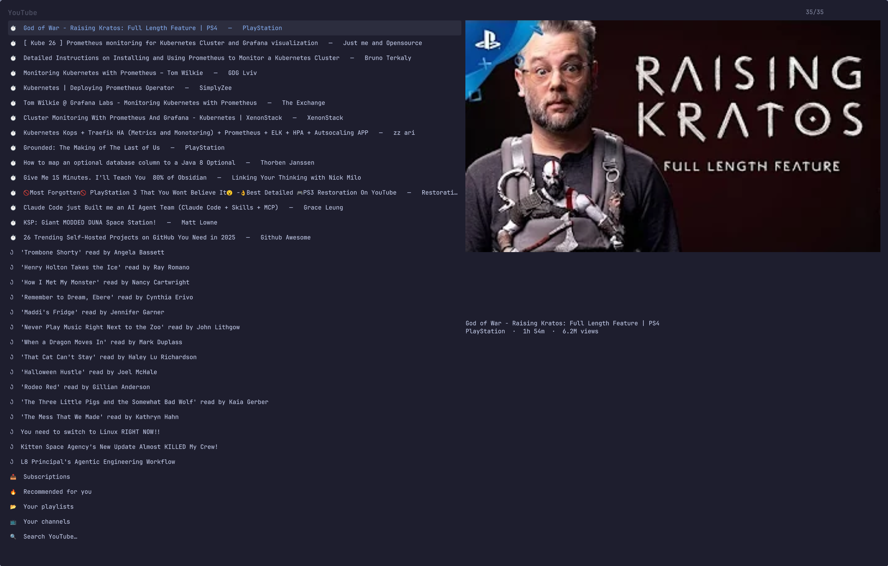

# YouTube Float

Browse YouTube and play a video in a small window that floats above everything
and follows you from workspace to workspace. Made for
[Omarchy](https://omarchy.org/).

Watch Later and anything you left partway through come first, then your
subscriptions, your playlists, your channels, and search.



## Install

```bash
omarchy plugin add https://github.com/jcputney/omarchy-media-float-youtube.git --enable
~/.config/omarchy/plugins/io.github.jcputney.media-float-youtube/setup
omarchy restart shell
```

The plugin and the command are separate halves, so there are two installers.
`omarchy plugin add` hands the shell the picker overlay. `setup` installs the
`youtube-float` command, the window rules, and checks you have mpv and yt-dlp.

The restart is the third line because the shell caches plugin QML once it has
loaded it — without it, the picker you just installed stays dark.

`setup --check` reports what is installed. `setup --uninstall` takes back
everything it wrote.

## Sign in

Search and channel browsing work signed out. Your subscriptions, Watch Later,
history and playlists need cookies:

```bash
youtube-float auth
```

That opens a browser profile used only by this tool. Sign in, close the window,
and it exports the cookies itself — no extension, no file to place, no `chmod`.
Your password goes into a real browser; the tool never sees it.

It follows your default browser where it can (Chromium, Chrome, Brave, Vivaldi
and Firefox are all supported), and falls back to whichever of Chromium or
Firefox is installed.

Cookies, not OAuth, because YouTube's Data API has had no route to your
recommendations, Watch Later or watch history since 2016. There is no OAuth
scope to ask for.

The dedicated profile is the trick that makes this stick. YouTube rotates the
session of a browser you keep using, which silently invalidates any cookies
exported from it — that is why exporting from your everyday browser fails. A
profile that is never browsed in again keeps its session, so re-running
`youtube-float auth` refreshes the cookies without asking you to sign in again.

That profile holds a live YouTube session, so it is stored 0700 under
`~/.local/share/youtube-float/browser`. Delete that directory to sign out.

Prefer to do it by hand? `youtube-float auth --manual` prints the older
cookies.txt-extension steps instead.

## Use it

```bash
youtube-float browse            # continue watching, subscriptions, search
youtube-float play <id|url>     # play one video
youtube-float quality toggle    # 720p <-> best, restarts the video
```

Every menu below the first level has a `←  Back` row at the top, and Escape
steps back one level rather than closing. Escape on the first level closes the
picker, as before.


Add keybindings to `~/.config/hypr/bindings.lua` — `setup` prints these rather
than editing the file, because which keys are free is your business:

```lua
o.bind("SUPER + ALT + Y", "YouTube: browse and play", "youtube-float browse")
o.bind("SUPER + ALT + SHIFT + Y", "YouTube: toggle video quality", "youtube-float quality toggle")
o.bind("SUPER + ALT + SHIFT + P", "Overlay: hide/show", "float-overlay toggle")
o.bind("SUPER + ALT + CTRL + P", "Overlay: close", "float-overlay quit")
o.bind("SUPER + ALT + O", "Overlay: cycle size", "float-overlay size cycle")
```

`float-overlay` drives whichever overlay is up, so the same three control keys
work for the Plex and Twitch tools too.

While something is playing: `SUPER` + right-drag resizes the window freehand,
`SUPER + ALT + O` cycles it through four preset sizes, and the screen will not
blank or lock.

## Remove it

Two commands, mirroring the install:

```bash
~/.config/omarchy/plugins/io.github.jcputney.media-float-youtube/setup --uninstall
omarchy plugin remove io.github.jcputney.media-float-youtube
```

`setup --uninstall` removes the `youtube-float` command, the shared `float-overlay`
command and library, `~/.config/hypr/media-float.lua`, and the marked block it
added to `hyprland.lua`. It leaves the shared pieces alone if another
media-float tool is still installed, and it never touches keybindings you added
yourself.

Your settings are deliberately left behind, so reinstalling does not make you
sign in again. Delete them yourself if you want them gone:

```bash
rm -rf ~/.config/youtube-float
```

The dedicated browser profile is separate again:

```bash
rm -rf ~/.local/share/youtube-float
```

That directory holds your YouTube cookies.

## Requirements

`mpv`, `yt-dlp`, `jq`, `curl`, `hyprctl`, `socat`, `xdg-utils`.

`fzf`, `chafa` and `ghostty` are optional. They are the fallback menu, used when
the shell plugin is disabled or you are not on Omarchy — the whole tool works
without the plugin, just in a terminal window instead of a native overlay.
`notify-send` is optional too; without it errors go to the terminal only.

Guided sign-in (`youtube-float auth`) opens a browser on a throwaway profile,
so it needs one of `firefox`, `chromium`, `google-chrome-stable`, `brave` or
`vivaldi`. `youtube-float auth --manual` does not.

## Related

- [omarchy-media-float-plex](https://github.com/jcputney/omarchy-media-float-plex)
- [omarchy-media-float-twitch](https://github.com/jcputney/omarchy-media-float-twitch)

Install any one of them on its own. Installed together they share the player
window, the overlay controls and the Hyprland rules.

## Licence

MIT.
